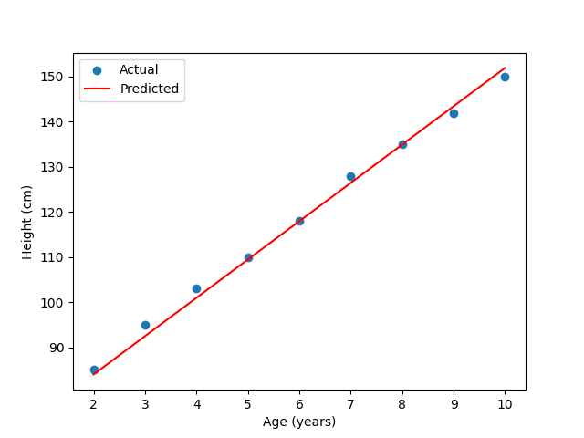

- [**Project 1:** Predicting Children’s Height with Linear Regression](#project-1-predicting-childrens-height-with-linear-regression)
  - [Linear Regression](#linear-regression)
    - [The Equation of a Line](#the-equation-of-a-line)
    - [Finding the Best Line](#finding-the-best-line)
  - [Loading and Understanding the Data](#loading-and-understanding-the-data)
    - [`data.json`](#datajson)
    - [`load_data_from_json` Function](#load_data_from_json-function)
  - [Initializing Parameters](#initializing-parameters)
  - [Making Predictions](#making-predictions)
    - [`predict` Function](#predict-function)
  - [Measuring Error](#measuring-error)
    - [What is a Loss Function?](#what-is-a-loss-function)
    - [Mean Squared Error (MSE)](#mean-squared-error-mse)
    - [`mse_loss` Function](#mse_loss-function)
  - [Learning from Mistakes](#learning-from-mistakes)
    - [Gradient Descent](#gradient-descent)
    - [Gradients](#gradients)
    - [`loss_grad = jax.grad(mse_loss, argnums=(0, 1))`](#loss_grad--jaxgradmse_loss-argnums0-1)
    - [`update` Function](#update-function)
  - [Training the Model](#training-the-model)
  - [Making Predictions and Visualizing Results](#making-predictions-and-visualizing-results)
    - [Interpreting the Plot](#interpreting-the-plot)
- [Project Structure](#project-structure)
  - [Running the Code](#running-the-code)


# **Project 1:** Predicting Children’s Height with Linear Regression

## Linear Regression

In this project, we'll build our first machine-learning model using a technique called linear regression. We'll use it to predict a child's height based on their age. This is a simple yet powerful example that will introduce you to many fundamental concepts in machine learning.

Linear regression is a way to model the relationship between two variables (in our case, age and height) using a straight line. The idea is to find the line that best fits the data we have.

### The Equation of a Line

You might remember the equation of a line from school: y = mx + b. In our project, we'll use slightly different names for the variables, but the concept is the same:

```python
height = weight * age + bias
```

`height` = The value we want to predict (the dependent varialbe).
`age` = The input value we're using for the prediction (the independent variable).
`weight` = The slope of the line. It tells us how much heights is expected to increase for each one-unit increase in age (e.g., how many centimeters a child grows per year).
`bias` = This is the y-intercept. It represents the predicted height when age is zero.

### Finding the Best Line

Our goal is to find the values of weight and bias that create a line that best fits our data points (the actual ages and heights of children). This line will then allow us to predict the height of a child of any given age.

## Loading and Understanding the Data

Let's look at how we load and prepare our synthetic data for the model.

### `data.json`

Our data is stored in a file named data.json. This file is formatted as a JSON (JavaScript Object Notation) object, which is a common way to store data in a human-readable and easily parsable format. Here's what it looks like:

```json
{
  "data": [
    {
      "age": 2,
      "height": 85
    },
    {
      "age": 3,
      "height": 95
    },
    {
      "age": 4,
      "height": 103
    },
    {
      "age": 5,
      "height": 110
    },
    {
      "age": 6,
      "height": 118
    },
    {
      "age": 7,
      "height": 128
    },
    {
      "age": 8,
      "height": 135
    },
    {
      "age": 9,
      "height": 142
    },
    {
      "age": 10,
      "height": 150
    }
  ]
}
```

It's a dictionary with a single key, "data", which contains a list of dictionaries. Each dictionary in the list represents a child, with their "age" and "height" recorded.

### `load_data_from_json` Function

This function reads the data from data.json and converts it into JAX arrays that we can use in our model.

```python
import jax.numpy as jnp
import json

def load_data_from_json(filepath):
    with open(filepath, 'r') as f:
        data = json.load(f)
    ages = jnp.array([item["age"] for item in data["data"]], dtype=jnp.float32)
    heights = jnp.array([item["height"] for item in data["data"]], dtype=jnp.float32)
    return ages, heights
```

Let's break down what this code does:

1. `with open(filepath, 'r') as f` This opens the `data.json` file in read mode ('r'). The with statement ensures the file is properly closed even if errors occur.
2. `data = json.load(f)` This reads the JSON data from the file and loads it into a Python dictionary called data.
3. `ages = jnp.array([item["age"] for item in data["data"]], dtype=jnp.float32)` This line does the following:
   - `[item["age"] for item in data["data"]]` This is a list comprehension that extracts the "age" value from each dictionary in the data["data"] list.
   - `jnp.array(...)` This converts the list of ages into a JAX array.
   - `dtype=jnp.float32` This specifies that the numbers in the array should be stored as 32-bit floating-point numbers. This is a common practice in machine learning for efficiency.
4. `heights = jnp.array([item["height"] for item in data["data"]], dtype=jnp.float32)`:` This does the same as above but extracts the "height" values and creates a JAX array of heights.
5. `return ages, heights` The function returns the two JAX arrays, ages and heights.

## Initializing Parameters

**`weight` and `bias`**: As we discussed earlier, `weight` and `bias` are the parameters of our linear regression model. They determine the slope and y-intercept of the line we're trying to find. We need to initialize these parameters with some starting values before we can begin training.

**`key = jax.random.PRNGKey(0)`**: This creates a pseudorandom number generator (PRNG) key. Machine learning often involves randomness, such as when initializing parameters or shuffling data. We use a PRNG key to control this randomness. By setting the seed to 0, we ensure that we get the same random numbers each time we run the code, which is important for reproducibility.

**`weight = jax.random.normal(key) and bias = jax.random.normal(key)`**:

- We initialize the weight parameter by generating a random number from a normal distribution centered around 0 using jax.random.normal(key). The normal distribution, also known as the bell curve, is a common way to generate random numbers with a specified mean and standard deviation.
- We do the same for the bias parameter, meaning it's also initialized with a random value drawn from a normal distribution.
- Initializing the parameters randomly, but close to zero, helps the model start its learning process from a reasonable starting point.

## Making Predictions

### `predict` Function

This function takes the weight, bias, and ages as input and calculates the predicted heights using the equation of a line.

```python
def predict(weight, bias, ages):
    return weight * ages + bias
```

This function directly implements the equation height = weight \* age + bias. It multiplies the weight by the ages array and adds the bias, resulting in an array of predicted heights.

## Measuring Error

### What is a Loss Function?

A loss function measures how well our model is performing. It quantifies the difference between the model's predictions and the actual values. The goal of training is to minimize this loss function.

### Mean Squared Error (MSE)

We'll use the Mean Squared Error (MSE) as our loss function. Here's how it works:

1. **Calculate the Error.** For each child, we subtract the actual height from the predicted height. This gives us the error (or residual) for that child.
2. **Square the Error.** We square each error. This does two things:
   - It makes all errors positive, so positive and negative errors don't cancel each other out.
   - It penalizes larger errors more heavily than smaller errors.
3. **Calculate the Mean.** We take the average (mean) of all the squared errors. This gives us a single number that represents the overall error of our model.

### `mse_loss` Function

```python
def mse_loss(weight, bias, ages, heights):
    predictions = predict(weight, bias, ages)
    return jnp.mean((predictions - heights)**2)
```

1. **`predictions = predict(weight, bias, ages)`**: This calls our predict function to get the predicted heights for the given ages, weight, and bias.
2. **`return jnp.mean((predictions - heights)**2)`\*\*: This calculates the MSE:
   - `(predictions - heights)`: Calculates the difference between the predicted and actual heights.
   - `(...)**2`: Squares the differences.
   - `jnp.mean(...)`: Calculates the average of the squared differences.

## Learning from Mistakes

### Gradient Descent

Gradient descent is an optimization algorithm used to find the values of weight and bias that minimize the loss function. It works by iteratively adjusting the parameters in the direction that reduces the loss the most.

### Gradients

The gradient of the loss function tells us the direction of the steepest increase in the loss. Since we want to decrease the loss, we move in the opposite direction of the gradient. You can think of it like rolling a ball downhill – the ball will naturally roll in the direction of the steepest downward slope.

### `loss_grad = jax.grad(mse_loss, argnums=(0, 1))`

This is where JAX's automatic differentiation capabilities shine!

`jax.grad(mse_loss, argnums=(0, 1))` calculates the gradient of the mse_loss function with respect to its first two arguments (weight and bias).

JAX automatically figures out how to calculate these gradients for us, which is a huge advantage.

### `update` Function

```python
def update(weight, bias, ages, heights, learning_rate):
    dw, db = loss_grad(weight, bias, ages, heights)
    weight_new = weight - learning_rate * dw
    bias_new = bias - learning_rate * db
    return weight_new, bias_new
```

1. **`dw, db = loss_grad(weight, bias, ages, heights)`**: This calls the `loss_grad` function (which we created using `jax.grad`) to calculate the gradients of the loss function with respect to weight (dw) and bias (db).
2. **`weight_new = weight - learning_rate * dw`**: This updates the weight parameter. We subtract a portion of the gradient (dw) from the current weight. The learning_rate controls how big of a step we take in the direction opposite to the gradient.
3. **`bias_new = bias - learning_rate * db`**: This does the same as above but updates the bias parameter using its gradient (db).
4. **`return weight_new, bias_new`**: The function returns the updated weight and bias.

## Training the Model

```python
learning_rate = 0.01
num_epochs = 1000

ages, heights = load_data_from_json("data.json")

for epoch in range(num_epochs):
    weight, bias = update(weight, bias, ages, heights, learning_rate)
    if epoch % 100 == 0:
        loss = mse_loss(weight, bias, ages, heights)
        print(f"Epoch {epoch}, Loss: {loss}")
```

- **`learning_rate = 0.01`**: We set the learning rate to 0.01. This is a hyperparameter that we can tune.

- **`num_epochs = 1000`**: We set the number of epochs to 1000. An epoch is one full pass through the training data.

- **`ages, heights = load_data_from_json("data.json")`**: We load the data from the data.json file.

- **`for epoch in range(num_epochs):`**: This loop iterates for the specified number of epochs.

  - `weight, bias = update(weight, bias, ages, heights, learning_rate)`: In each epoch, we call the update function to update the weight and bias using the gradients and the learning rate.

  - `if epoch % 100 == 0:`: Every 100 epochs, we calculate and print the loss to monitor the training progress.

    - `loss = mse_loss(weight, bias, ages, heights)`: We calculate the loss using the current weight and bias.

    - `print(f"Epoch {epoch}, Loss: {loss}")`: We print the epoch number and the corresponding loss.

## Making Predictions and Visualizing Results

```python
# 7. Make Predictions
predicted_heights = predict(weight, bias, ages)

# 8. Visualize the Results
plt.scatter(ages, heights, label="Actual")
plt.plot(ages, predicted_heights, label="Predicted", color="red")
plt.xlabel("Age (years)")
plt.ylabel("Height (cm)")
plt.legend()
plt.show()

print(f"Trained weight: {weight}, Trained bias: {bias}")
```

- **`predicted_heights = predict(weight, bias, ages)`**: After training, we use the learned weight and bias to make predictions on the same ages data using our predict function.

- **`plt.scatter(ages, heights, label="Actual")`**: This creates a scatter plot of the actual data points, with ages on the x-axis and heights on the y-axis. The label="Actual" is used for the legend.

- **`plt.plot(ages, predicted_heights, label="Predicted", color="red")`**: This plots a line representing the predicted heights. The line connects the predicted heights for each age in our ages data.

- **`plt.xlabel("Age (years)"), plt.ylabel("Height (cm)")`**: These add labels to the x and y axes.

- **`plt.legend()`**: This displays the legend to distinguish between the actual and predicted data.

- **`plt.show()`**: This shows the plot.

- **`print(f"Trained weight: {weight}, Trained bias: {bias}")`**: We print the final trained values of weight and bias.

### Interpreting the Plot


The plot visually shows us how well our model fits the data. The closer the red line (predicted heights) is to the blue dots (actual heights), the better our model is at predicting heights based on age.

# Project Structure

```
jaxml/
└── height_prediction/
    ├── main.py        # Python script containing the model, training logic, and data loading.
    └── data.json      # JSON file containing the age and height dataset.
```

## Running the Code

- Navigate to the `jaxml/height_prediction` directory in your terminal.
- Execute the `main.py` script: `python main.py`
- The script will print the loss during training at intervals of 100 epochs.
- After training, it will display a plot showing the actual vs. predicted heights.
- The trained weight (`w`) and bias (`b`) of the linear model will be printed.
