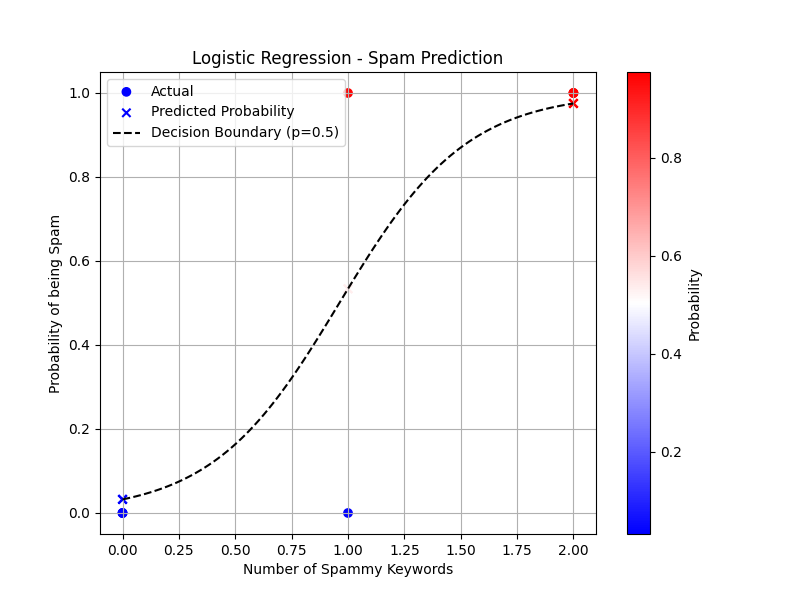

> [!IMPORTANT]
> This project builds on concepts from [Project 1: Predicting Children’s Height with Linear Regression](../height_prediction/README.md). If any terms seem unfamiliar, please review [Project 1](../height_prediction//README.md) before proceeding.

- [**Project #2:** Spam Detection with Logistic Regression](#project-2-spam-detection-with-logistic-regression)
  - [Logistic Regression](#logistic-regression)
    - [The Sigmoid Function](#the-sigmoid-function)
    - [Logistic Regression Formula](#logistic-regression-formula)
  - [Preparing the Data](#preparing-the-data)
    - [`spam_keywords.json`](#spam_keywordsjson)
    - [`load_spammy_keywords` Function](#load_spammy_keywords-function)
  - [Loading and Preprocessing the Data](#loading-and-preprocessing-the-data)
    - [`data.json`](#datajson)
    - [`load_and_preprocess_data` Function](#load_and_preprocess_data-function)
      - [What It Does](#what-it-does)
  - [Initializing Parameters](#initializing-parameters)
  - [The Sigmoid Function](#the-sigmoid-function-1)
  - [Prediction Spam Probability](#prediction-spam-probability)
  - [Measuring Error](#measuring-error)
    - [Formula](#formula)
    - [`binary_cross_entropy_loss` Function](#binary_cross_entropy_loss-function)
  - [`update` Function](#update-function)
  - [Training the Model](#training-the-model)
    - [Evaluating the Model](#evaluating-the-model)
  - [Classifying New Emails](#classifying-new-emails)
    - [`classify_new_emails` Function](#classify_new_emails-function)
    - [`load_and_classify_new_emails` Function](#load_and_classify_new_emails-function)
  - [Visualizing the Results](#visualizing-the-results)
- [Project Structure](#project-structure)
  - [Running the Code](#running-the-code)
  - [Output](#output)

# **Project #2:** Spam Detection with Logistic Regression

In this project, we'll tackle a different type of machine learning problem: classification. Specifically, we'll build a model that can classify emails as either "spam" or "not spam". We'll use a technique called logistic regression for this task.

## Logistic Regression

Unlike linear regression, which predicts continuous values, logistic regression is used to predict the probability of something belonging to a certain category. In our case, we want to predict the probability that an email is spam.

### The Sigmoid Function

The core of logistic regression is the sigmoid function. This function takes any number as input and squashes it into a value between 0 and 1. This output can be interpreted as a probability.

The formula for the sigmoid function is:

```python
sigmoid(z) = 1 / (1 + exp(-z))
```

- `z` is any real number.
- exp(-z) is the exponential function (e to the power of -z).
- When `z` is large and positive, `sigmoid(z)` approaches 1. When `z` is large and negative, `sigmoid(z)` approaches 0. When `z` is 0, `sigmoid(z) is 0.5.

### Logistic Regression Formula

In logistic regression, we first calculate a value `z` in a similar way to linear regression.

```python
z = weight * features * bias
```

**`features`**- These are characteristics of the email that we think might be indicative of spam. In our project, we'll use the number of spammy keywords in the email as our feature.

**`weight`** and **`bias`** - These are the parameters of our model that we'll need to learn during training.

Then, we apply the sigmoid function to `z` to get the probability that the email is spam:

```python
probability(spam) = sigmoid(z) = sigmoid(weight * features + bias)
```

## Preparing the Data

### `spam_keywords.json`

This file contains a list of words or phrases that we consider to be indicative of spam emails (e.g., "free," "money," "urgent," "win").

```json
{
  "keywords": [
    "free",
    "money",
    "urgent",
    "win",
    "guaranteed",
    "click here",
    "discount",
    "offer",
    "prize",
    "cash"
  ]
}
```

### `load_spammy_keywords` Function

This function simply reads the list of spammy keywords from the spam_keywords.json file.

```python
def load_spammy_keywords(filepath):
    with open(filepath, 'r') as f:
        keywords = json.load(f)
    return keywords["keywords"]
```

## Loading and Preprocessing the Data

### `data.json`

This file contains our training data, which consists of a set of emails. Each email has two parts:

1. `text`: The body of the email.
2. `is_spam`: A label indicating whether the email is spam (1) or not spam (0).

```json
{
  "emails": [
    {
      "text": "Hello, this is a normal email.",
      "is_spam": 0
    },
    {
      "text": "You have won a free vacation! Click here to claim now.",
      "is_spam": 1
    },
    {
      "text": "Get a discount on your next purchase.",
      "is_spam": 0
    },
    {
      "text": "Urgent! Your account needs verification. Money is needed.",
      "is_spam": 1
    },
    {
      "text": "Meeting reminder for tomorrow.",
      "is_spam": 0
    },
    {
      "text": "Make money fast with this guaranteed method.",
      "is_spam": 1
    },
    {
      "text": "Here is your free gift.",
      "is_spam": 1
    },
    {
      "text": "Project update and next steps.",
      "is_spam": 0
    }
  ]
}
```

### `load_and_preprocess_data` Function

This function loads the data from data.json, preprocesses it, and converts it into JAX arrays.

```python
import re

def load_and_preprocess_data(filepath, spammy_keywords):
    with open(filepath, 'r') as f:
        data = json.load(f)

    features = []
    is_spam = []
    for item in data["emails"]:
        email_text = item["text"].lower()
        keyword_count = sum(1 for keyword in spammy_keywords if re.search(
            r'\b' + keyword + r'\b', email_text))
        features.append(keyword_count)
        is_spam.append(item["is_spam"])

    features = jnp.array(features, dtype=jnp.float32)
    is_spam = jnp.array(is_spam, dtype=jnp.float32)
    return features, is_spam
```

#### What It Does

1. `with open(filepath, 'r') as f` - Opens the data.json file for reading.
2. `data = json.load(f)` Loads the JSON data into a Python dictionary.

3. `features = [], is_spam = []` Initializes empty lists to store the features (keyword counts) and labels (spam/not spam).

4. `for item in data["emails"]` Iterates through each email in the dataset.

   - `email_text = item["text"].lower()` Converts the email text to lowercase for case-insensitive matching.
   - `keyword_count = sum(1 for keyword in spammy_keywords if re.search(r'\b' + keyword + r'\b', email_text))` This is the core of the feature extraction.

     - `re.search(r'\b' + keyword + r'\b', email_text)` This uses a regular expression to check if a keyword is present in the email_text as a whole word. \b matches a word boundary, so it won't match "freeman" if the keyword is "free".
     - `sum(1 for ... if ...)` This counts the number of keywords found in the email.

- `features.append(keyword_count)` Appends the keyword count (our feature) to the features list.

- `is_spam.append(item["is_spam"])` Appends the spam label (0 or 1) to the is_spam list.

5. `features = jnp.array(features, dtype=jnp.float32)` Converts the features list into a JAX array of 32-bit floats.

6. `is_spam = jnp.array(is_spam, dtype=jnp.float32)` Converts the is_spam list into a JAX array.

7. `return features, is_spam` Returns the JAX arrays of features and labels.

## Initializing Parameters

Just like in [Project 1](../height_prediction/README.md), we initialize the weight and bias parameters with random values drawn from a normal distribution using `jax.random.normal(key)`. We use `jax.random.PRNGKey(0)` to ensure reproducibility.

```
key = jax.random.PRNGKey(0)
weight = jax.random.normal(key)
bias = jax.random.normal(key)
```

## The Sigmoid Function

This is the sigmoid function we discussed earlier. It takes a real number z and returns a value between 0 and 1, which we'll interpret as a probability.

```python
def sigmoid(z):
    return 1 / (1 + jnp.exp(-z))
```

## Prediction Spam Probability

```
def predict(weight, bias, features):
    z = weight * features + bias
    return sigmoid(z)
```

**`z = weight * features = bias`** This calculates the value of z, similar to linear regression.

**`return sigmoid(z)`** This applies the sigmoid function to z to obtain the predicted probability of the email being spam.

## Measuring Error

For logistic regression, we use a loss function called binary cross-entropy. This loss function is well-suited for binary classification problems where we're predicting probabilities.

### Formula

The formula for binary cross-entropy loss is a bit more complex than Mean Squared Error, but here's a simplified explanation:

```
loss = -[y * log(p) + (1 - y) * log(1 - p)]
```

- `y` is the true label (0 or 1).
- `p` is the predicted probability of the positive class (spam, in our case).
- `log` is the natural logarithm.

The formula might look intimidating, but it penalizes the model more when it makes confident but incorrect predictions. For example:

- If an email is spam (`y = 1`) and the model predicts a low probability of spam (e.g., `p = 0.1`), the `log(p) term will be large and negative, resulting in a high loss.
- If an email is not spam (y = 0) and the model predicts a high probability of spam (e.g., `p = 0.9`), the `log(1-p)` term will be large and negative, also resulting in a high loss.

### `binary_cross_entropy_loss` Function

```
def binary_cross_entropy_loss(weight, bias, features, is_spam):
    probabilities = predict(weight, bias, features)
    epsilon = 1e-7
    loss = -jnp.mean(is_spam * jnp.log(probabilities + epsilon) +
                     (1 - is_spam) * jnp.log(1 - probabilities + epsilon))
    return loss
```

1. `probabilities = predict(weight, bias, features)`: This calls our predict function to get the predicted probabilities for the given features, weight, and bias.

2. `epsilon = 1e-7`: This sets a small value for epsilon to prevent taking the log of 0, which is undefined and will throw an error.

3. `loss = -jnp.mean(is_spam jnp.log(probabilities + epsilon) + (1 - is_spam) jnp.log(1 - probabilities + epsilon))`: This calculates the binary cross-entropy loss:
   - `jnp.log(...)`: Calculates the natural logarithm.
   - The rest of the formula implements the binary cross-entropy calculation as described above.
   - `jnp.mean(...)`: Averages the loss over all the emails in the dataset.

## `update` Function

This is the same as in Project 1. We use `jax.grad` to automatically calculate the gradients of the `binary_cross_entropy_loss` function with respect to weight and bias. Then, we update `weight` and `bias` by moving in the opposite direction of the gradients, scaled by the `learning_rate`.

```python
loss_grad = jax.grad(binary_cross_entropy_loss, argnums=(0, 1))

def update(weight, bias, features, is_spam, learning_rate):
    dw, db = loss_grad(weight, bias, features, is_spam)
    weight_new = weight - learning_rate * dw
    bias_new = bias - learning_rate * db
    return weight_new, bias_new
```

## Training the Model

```python
learning_rate = 0.1
num_epochs = 1000

# ... (load data and initialize parameters) ...

for epoch in range(num_epochs):
    weight, bias = update(weight, bias, features, is_spam, learning_rate)
    if epoch % 100 == 0:
        loss = binary_cross_entropy_loss(weight, bias, features, is_spam)
        print(f"Epoch {epoch}, Loss: {loss}")
```

The training loop is very similar to Project 1. We iterate for a certain number of `num_epochs`, updating the `weight` and `bias` in each epoch using the `update` function. We print the `loss` every 100 epochs to monitor progress.

### Evaluating the Model

```python
probabilities = predict(weight, bias, features)
predictions = (probabilities >= 0.5).astype(jnp.int32)
accuracy = jnp.mean(predictions == is_spam)
print(f"Accuracy: {accuracy * 100:.2f}%")
```

`probabilities = predict(weight, bias, features)`: We use the trained weight and bias to predict probabilities for the training data.

`predictions = (probabilities >= 0.5).astype(jnp.int32)`: We convert probabilities to class labels (0 or 1). If the probability is greater than or equal to 0.5, we classify the email as spam (1); otherwise, we classify it as not spam (0). We then cast these values to integers.

`accuracy = jnp.mean(predictions == is_spam)`: We calculate the accuracy, which is the percentage of correctly classified emails.

## Classifying New Emails

- [**`validate.json`**](./validate.json): This file contains new emails that we want to classify using our trained model. The structure is similar to [`data.json`](./data.json).

### `classify_new_emails` Function

```python
def classify_new_emails(emails_to_classify, weight, bias, spammy_keywords):
    predictions = []
    for email in emails_to_classify:
        text = email["text"].lower()
        keyword_count = sum(1 for keyword in spammy_keywords if re.search(
            r'\b' + keyword + r'\b', text))
        features = jnp.array([keyword_count], dtype=jnp.float32)
        probability = predict(weight, bias, features)
        prediction = (probability >= 0.5).astype(jnp.int32)[0]
        predictions.append(prediction)
    return predictions
```

1. **`predictions = []`:** Initializes an empty list to store the predictions.
2. **`for email in emails_to_classify:`:** Iterates through the new emails.
   - **`text = email["text"].lower()`:** Converts the email text to lowercase.
   - **`keyword_count = ...`:** Counts the spammy keywords in the email (same preprocessing as before).
   - **`features = jnp.array([keyword_count], dtype=jnp.float32)`:** Creates a JAX array with the keyword count as the feature.
   - **`probability = predict(weight, bias, features)`:** Predicts the probability of spam using the trained `weight` and `bias`.
   - **`prediction = (probability >= 0.5).astype(jnp.int32)[0]`:** Classifies the email based on the probability (1 if >= 0.5, 0 otherwise).
   - **`predictions.append(prediction)`:** Appends the prediction to the list.
3. **`return predictions`:** Returns the list of predictions.

### `load_and_classify_new_emails` Function

```python
def load_and_classify_new_emails(filepath, weight, bias, spammy_keywords):
    with open(filepath, 'r') as f:
        new_emails = json.load(f)

    predictions = classify_new_emails(
        new_emails["emails"], weight, bias, spammy_keywords)

    for i, email in enumerate(new_emails["emails"]):
        print(f"Email: {email['text']}")
        print(f"Prediction: {'Spam' if predictions[i] == 1 else 'Not Spam'}")
        print("-" * 20)
```

1. **`with open(filepath, 'r') as f:`:** Opens the `validate.json` file.
2. **`new_emails = json.load(f)`:** Loads the new emails from the JSON file.
3. **`predictions = classify_new_emails(...)`:** Calls the `classify_new_emails` function to get predictions for the new emails.
4. **`for i, email in enumerate(new_emails["emails"]):`:** Iterates through the new emails and prints the email text and the model's prediction.

## Visualizing the Results



The matplotlib code in this project is a bit more involved than in Project 1, but it provides a helpful visualization of the model's performance.

```
plt.figure(figsize=(8, 6))
plt.scatter(features, is_spam, c=is_spam, cmap='bwr', label='Actual')
plt.scatter(features, probabilities, c=probabilities, cmap='bwr',
            marker='x', label='Predicted Probability')
plt.xlabel("Number of Spammy Keywords")
plt.ylabel("Probability of being Spam")
plt.title("Logistic Regression - Spam Prediction")

boundary_x = jnp.linspace(0, jnp.max(features), 100)
boundary_y = sigmoid(weight * boundary_x + bias)
plt.plot(boundary_x, boundary_y, color='black',
         linestyle='--', label='Decision Boundary (p=0.5)')

plt.legend()
plt.colorbar(label='Probability')
plt.grid(True)
plt.show()
```

`plt.figure(figsize=(8, 6))`: Creates a new figure with a specified size.

`plt.scatter(features, is_spam, c=is_spam, cmap='bwr', label='Actual')`: Creates a scatter plot of the training data, where the x-axis is the number of spammy keywords (features) and the y-axis is the true label (is_spam). The c=is_spam argument colors the points based on their true label (blue for not spam, red for spam).

`plt.scatter(features, probabilities, c=probabilities, cmap='bwr', marker='x', label='Predicted Probability')`: Creates another scatter plot showing the predicted probabilities. The x-axis is still the number of spammy keywords, but the y-axis is now the predicted probability. The points are colored based on the predicted probability (blue for low probability, red for high probability).

`plt.xlabel(...), plt.ylabel(...), plt.title(...)`: Adds labels and a title to the plot.

`boundary_x = jnp.linspace(0, jnp.max(features), 100)`: Creates a set of 100 evenly spaced points between 0 and the maximum number of spammy keywords.

`boundary_y = sigmoid(weight \* boundary_x + bias)`: Calculates the corresponding probabilities for these points using the trained weight and bias. This effectively creates the decision boundary.

`plt.plot(boundary_x, boundary_y, color='black', linestyle='--', label='Decision Boundary (p=0.5)')`: Plots the decision boundary, which is the line where the predicted probability is 0.5.

`plt.legend(), plt.colorbar(...), plt.grid(True)`: Adds a legend, a color bar to show the probability scale, and a grid to the plot.

`plt.show()`: Displays the plot.

# Project Structure

```text
jaxml/
└── spam_detection/
    ├── main.py                # Python script with the model, training, and classification logic.
    ├── emails.json            # JSON file containing the training email dataset.
    ├── new_emails.json        # JSON file containing new emails to be classified.
    └── spammy_keywords.json   # JSON file containing a list of spammy keywords.
```

## Running the Code

1. **Navigate:** Go to the `jaxml/spam_detection` directory in your terminal.
2. **Execute:** Run the script using: `python main.py`

## Output

The script will:

1. **Train:** Print the loss during training every 100 epochs.
2. **Evaluate:** Print the accuracy of the trained model on the training data.
3. **Classify:** Load emails from `new_emails.json`, classify them, and print the predictions:

   ```
   Email: This is a test email to check the spam filter.
   Prediction: Not Spam
   --------------------
   Email: You have won a lottery! Click here to claim your prize money now!
   Prediction: Spam
   --------------------
   ```

4. **Visualize (Optional):** Display a plot showing the decision boundary and how the model classifies the training data points.
